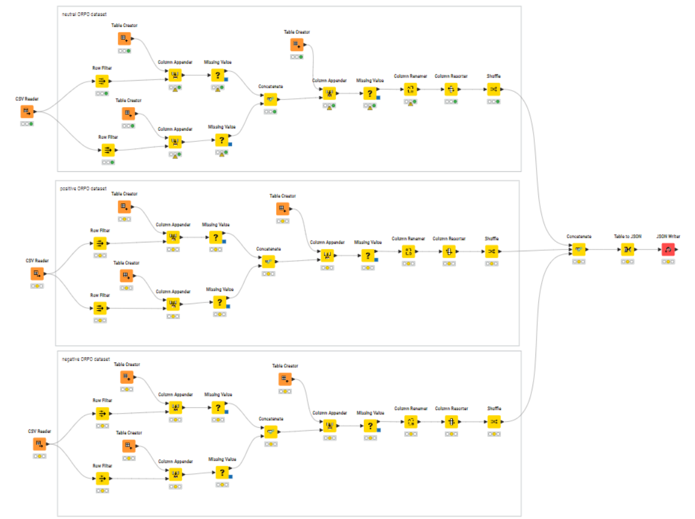

## 📊 Phase 1: Data Preprocessing (KNIME)



## 1️⃣ Extract & Pair Neutral Sentiments 


### 🎯 Purpose:
To isolate **neutral sentiment samples** and create "rejected" sentiment pairs to comply with ORPO's preference data structure.

### 🧩 What It Does:
- Filters the dataset to select all rows where `airline_sentiment = neutral`.
- **Branch A:** Appends `"positive"` as a `rejected` label.
- **Branch B:** Appends `"negative"` as a `rejected` label.
- Both branches are merged using a **Concatenate Node**, resulting in each **neutral sample** being paired with **two rejected alternatives**.

### ✅ Output:
A dataset where **neutral samples** are combined with rejected labels (`positive`, `negative`) in preparation for preference-based fine-tuning.

---

## 2️⃣ Instruction & Input Construction 


### 🎯 Purpose:
To integrate system instructions and construct final input fields for ORPO fine-tuning format.

### 🧩 What It Does:
- Creates a reusable system prompt:  
  `"Classify the input using one of these labels: neutral, positive, and negative."`
- Appends this `instruction` to each sample and combines it with the `text` field (tweet content), forming the final `input`.
- Standardizes the output columns to match the ORPO data format:  
  `instruction`, `input`, `accepted`, and `rejected`.

### ✅ Output:
An enriched dataset where every row now contains the **instruction + input pair**, along with the `accepted` and `rejected` labels.

---

## 3️⃣ Dataset Consolidation & JSON Export 


### 🎯 Purpose:
To finalize the dataset structure and export the ORPO-compatible preference dataset.

### 🧩 What It Does:
- Merges datasets from **neutral**, **positive**, and **negative** sentiment pipelines into a **single table**.
- Shuffles the dataset to avoid sequential bias during training.
- Converts the final table into **JSON format** using the `Table to JSON` node.
- Exports the data as `orpo_train.json` for downstream use (e.g., uploading to Hugging Face or feeding into the ORPO training pipeline).

### ✅ Output:
A ready-to-use **ORPO preference dataset** in JSON format, structured for immediate use in LLM fine-tuning workflows.

---

### 🎯 **Sample JSON Output**

```json
{
  "instruction": "Classify the input using one of these labels: neutral, positive, and negative.",
  "input": "@USAirways Do you have a phone Nbr for Refund Dept?",
  "accepted": "neutral",
  "rejected": "positive, negative"
}
